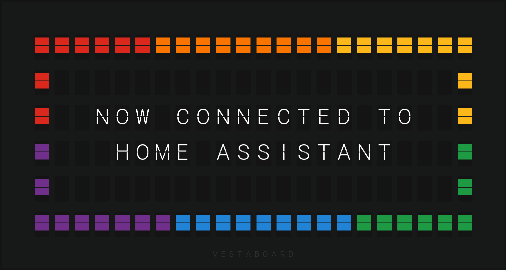
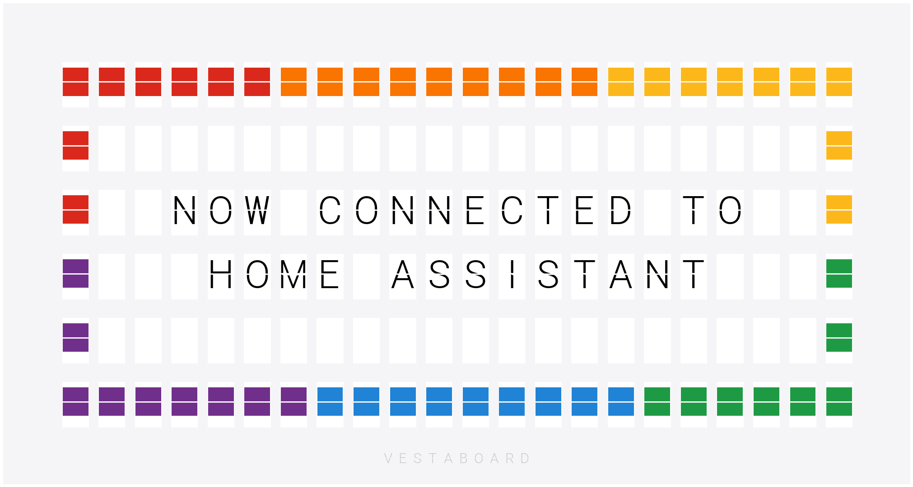
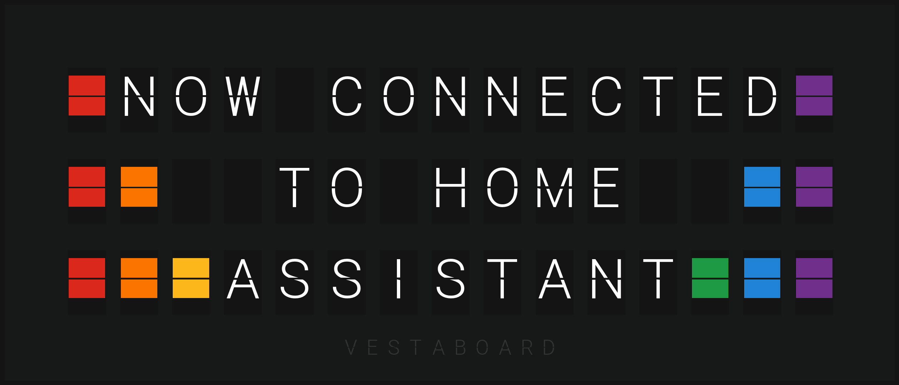
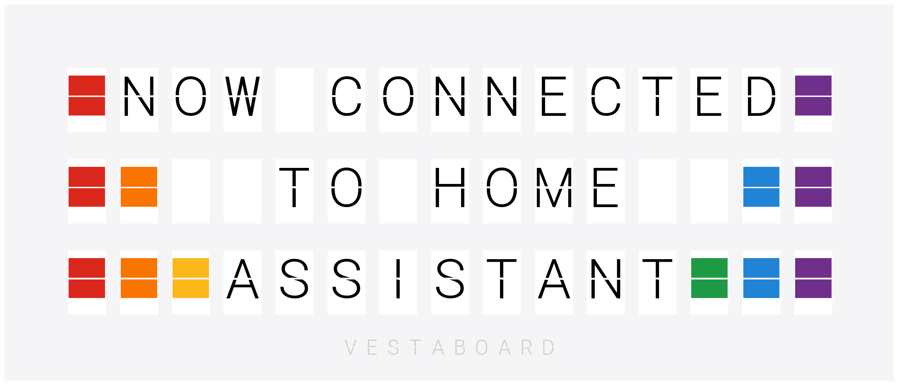

<picture>
  <source media="(prefers-color-scheme: dark)" srcset="https://brands.home-assistant.io/vestaboard/dark_logo.png">
  
</picture>

# Vestaboard for Home Assistant

Home Assistant integration for Vestaboard messaging displays.

## 🔐 Local API Access Required

To use this integration, you **must first request access to Vestaboard's Local API**. This is required to enable local communication with your Vestaboard device.

### ✅ How to Request Access

1. Visit [https://www.vestaboard.com/local-api](https://www.vestaboard.com/local-api).
2. Fill out the request form to apply for a Local API enablement token.
3. Once approved, you will receive a token that you'll need to configure this integration.

⚠️ **Note:** The integration will not function without this token. Be sure to complete this step before proceeding with setup.

## ⬇️ Installation

### HACS (Recommended)

This integration is available in the default [HACS](https://hacs.xyz/) repository.

1. Use the **My Home Assistant** badge above, or from within Home Assistant, click on **HACS**
2. Search for `Vestaboard` and click on the appropriate repository
3. Click **DOWNLOAD**
4. Restart Home Assistant

### Manual

If you prefer manual installation:

1. Download or clone this repository
2. Copy the `custom_components/vestaboard` folder to your Home Assistant `custom_components` directory
3. Restart Home Assistant

> ⚠️ Manual installation will not provide automatic update notifications. HACS installation is recommended unless you have a specific need.

## ➕ Setup

Once installed, you can set up the integration by clicking on the following badge:

Alternatively:

1. Go to [Settings > Devices & services](https://my.home-assistant.io/redirect/integrations/)
2. In the bottom-right corner, select **Add integration**
3. Type `Vestaboard` and select the **Vestaboard** integration
4. Follow the instructions to add the integration to your Home Assistant

## ⚙️ Options

After this integration is set up, you can configure the color of your Vestaboard to adjust the image that is generated.

|          |                                       Black                                       |                                       White                                       |
| -------- | :-------------------------------------------------------------------------------: | :-------------------------------------------------------------------------------: |
| Flagship |  |  |
| Note     |           |           |

---

## ❤️ Support Me

I maintain this Home Assistant integration in my spare time. If you find it useful, consider supporting development:

- 💜 [Sponsor me on GitHub](https://github.com/sponsors/natekspencer)
- ☕ [Buy me a coffee / beer](https://ko-fi.com/natekspencer)
- 💸 [PayPal (direct support)](https://www.paypal.com/paypalme/natekspencer)
- ⭐ [Star this project](https://github.com/natekspencer/ha-vestaboard)
- 📦 If you’d like to support in other ways, such as donating hardware for testing, feel free to [reach out to me](https://github.com/natekspencer)

If you don't already own a Vestaboard, please consider using my referral link below to get $200 off (as well as a $200 referral bonus to me in appreciation)!

[Save $200 off a Vestaboard](https://web.vestaboard.com/referral?vbref=ZWVLZW)

## 📈 Star History

