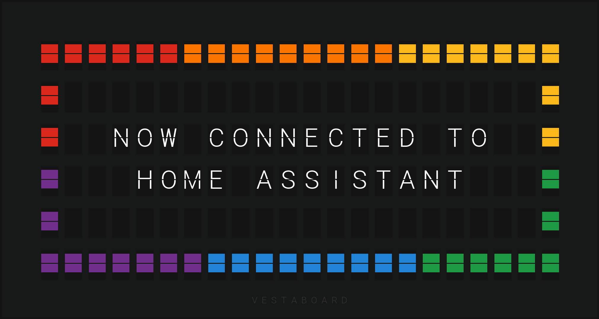
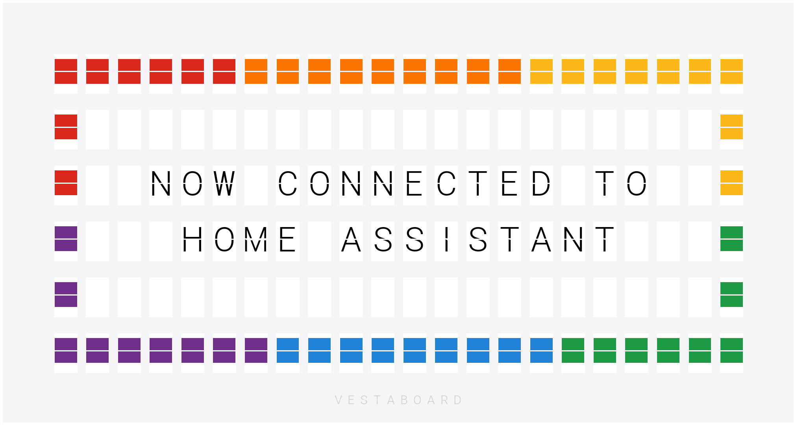
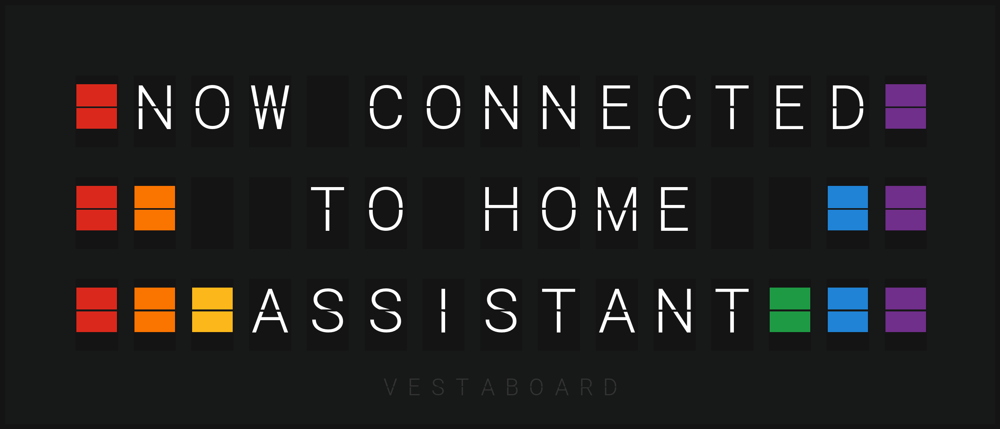
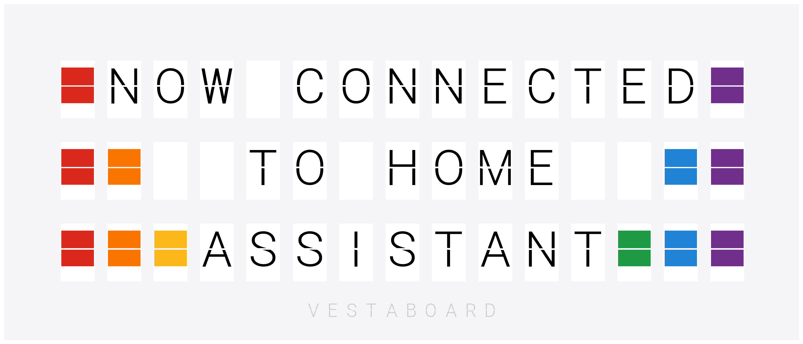
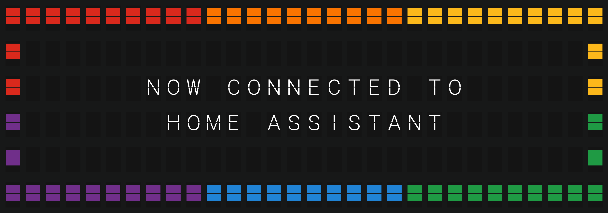
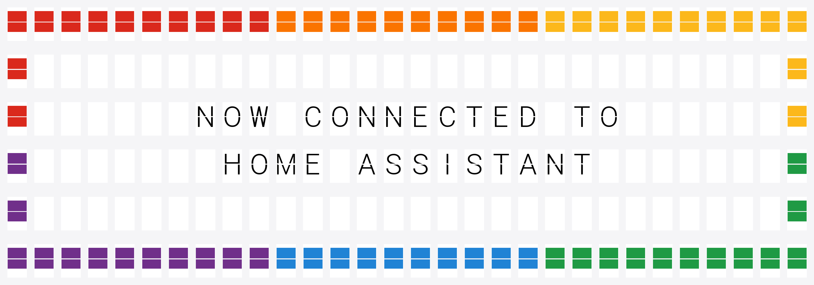

<picture>
  <source media="(prefers-color-scheme: dark)" srcset="https://brands.home-assistant.io/vestaboard/dark_logo.png">
  
</picture>

# Vestaboard for Home Assistant

[](https://github.com/natekspencer/ha-vestaboard/releases)
[](https://github.com/hacs/integration)
[](https://ko-fi.com/natekspencer)
[](https://github.com/sponsors/natekspencer)


Home Assistant integration for Vestaboard messaging displays.

- Control Vestaboard Flagship and Vestaboard Note boards over the Local API
- Create [virtual Vestaboards](#virtual-vestaboards) to try out messages without any hardware
- Combine Vestaboard Notes into a [Note array](#vestaboard-note-arrays) that acts as one larger board

## 🔐 Local API Access Required

To connect a physical Vestaboard, you **must first request access to Vestaboard's Local API**. This is required to enable local communication with your Vestaboard device. Virtual Vestaboards don't need it.

### ✅ How to Request Access

1. Visit [https://www.vestaboard.com/local-api](https://www.vestaboard.com/local-api).
2. Fill out the request form to apply for a Local API enablement token.
3. Once approved, you will receive a token that you'll need to configure this integration.

⚠️ **Note:** A physical Vestaboard can't be added without this token. Be sure to complete this step before proceeding with setup.

## ⬇️ Installation

### HACS (Recommended)

[](https://my.home-assistant.io/redirect/hacs_repository/?owner=natekspencer&repository=ha-vestaboard&category=integration)

This integration is available in the default [HACS](https://hacs.xyz/) repository.

1. Use the **My Home Assistant** badge above, or from within Home Assistant, click on **HACS**
2. Search for `Vestaboard` and click on the appropriate repository
3. Click **DOWNLOAD**
4. Restart Home Assistant

### Manual

If you prefer manual installation:

1. Download or clone this repository
2. Copy the `custom_components/vestaboard` folder to your Home Assistant `custom_components` directory
3. Restart Home Assistant

> ⚠️ Manual installation will not provide automatic update notifications. HACS installation is recommended unless you have a specific need.

## ➕ Setup

Once installed, you can set up the integration by clicking on the following badge:

[](https://my.home-assistant.io/redirect/config_flow_start/?domain=vestaboard)

Alternatively:

1. Go to [Settings > Devices & services](https://my.home-assistant.io/redirect/integrations/)
2. In the bottom-right corner, select **Add integration**
3. Type `Vestaboard` and select the **Vestaboard** integration
4. Choose what to add:
   - **Add a Vestaboard** — connect a physical Vestaboard using its host and Local API key
   - **Create a virtual Vestaboard** — see [Virtual Vestaboards](#virtual-vestaboards)
   - **Create a Vestaboard Note array** — see [Vestaboard Note arrays](#vestaboard-note-arrays) (shown once at least two Notes are set up)
5. Follow the instructions to add the integration to your Home Assistant

Physical Vestaboards on your network are also discovered automatically. If a board's IP address changes, use **Reconfigure** on its entry to update the host.

### Virtual Vestaboards

A virtual Vestaboard behaves like a real one in Home Assistant, with the same entities, image and `vestaboard.message` action, but has no hardware behind it. Use one to try out messages and automations, or to try out an array before you buy more boards.

When creating one, choose a name and a model: **Vestaboard Flagship (6 x 22)** or **Vestaboard Note (3 x 15)**. A virtual board's message is saved and restored when Home Assistant restarts.

### Vestaboard Note arrays

A Note array combines Vestaboard Notes that are already set up, real or virtual, into one larger board. A message sent to the array is laid out across the whole grid, and each Note is sent its portion. The array writes through each Note's own connection, so it holds no API keys of its own.

To create an array:

1. Set up each Vestaboard Note first. At least two Notes, real or virtual, must be set up and loaded before **Create a Vestaboard Note array** is offered.
2. Choose **Create a Vestaboard Note array**, give it a name and choose an arrangement, such as 2 Notes side by side, or 4 Notes in 2 rows of 2. The arrangements offered depend on how many Notes you have set up.
3. Choose the Note for each position, filled left to right, top to bottom. Each step shows the layout so far and what each available Note is currently showing.

Turn on **Show each Note's name on it while arranging** to help tell your Notes apart. Each Note goes back to what it was showing when you finish or close the setup.

Use **Reconfigure** on the array to change its name, arrangement or Notes. If a Note in an array is deleted or disabled, Home Assistant raises a repair with options to fix the array: re-enable the Note, reconfigure the array, or delete the array.

## ⚙️ Options

After a Vestaboard is set up, open its **Configure** dialog to change:

- **Color** (boards only) — the color of your Vestaboard (black or white), used for the generated image. Each Note in an array is drawn in its own color.
- **Show frame** — draw the image with the Vestaboard's frame and logo. When off, only the bits are drawn, edge to edge. This is on by default for boards. Arrays are drawn as one continuous, frameless board by default; turning this on draws each Note in its own frame.
- **Default transition** — the transition strategy, step size and step interval used when a message doesn't set its own. See [Transition Strategy](#transition-strategy).

|            |                                         Black                                         |                                         White                                         |
| ---------- | :-----------------------------------------------------------------------------------: | :-----------------------------------------------------------------------------------: |
| Flagship   |      |      |
| Note       |               |               |
| Note array |  |  |

The Note array images show 4 Notes in 2 rows of 2.

## 🧩 Entities

Each Vestaboard, virtual Vestaboard and Note array has the following entities:

| Entity                       | Type          | Description                                                                                                                             |
| ---------------------------- | ------------- | --------------------------------------------------------------------------------------------------------------------------------------- |
| Image                        | Image         | An image of what the board is showing.                                                                                                  |
| Message                      | Sensor        | The text the board is showing. Messages over 255 characters are trimmed in the state; the full text is in the `full_message` attribute. |
| Temporary message            | Binary sensor | On while a temporary message (sent with `duration`) is showing.                                                                         |
| Temporary message expiration | Sensor        | When the current temporary message expires.                                                                                             |
| Clear temporary message      | Button        | Clears the temporary message and restores the board's persistent message.                                                               |
| Quiet hours                  | Switch        | Turns quiet hours on or off. Turning it on with no times set uses 22:00 to 07:00.                                                       |
| Quiet hours start            | Time          | When quiet hours start.                                                                                                                 |
| Quiet hours end              | Time          | When quiet hours end. If the start and end times are the same, quiet hours last all day.                                                |

During quiet hours, messages sent with `vestaboard.message` are skipped, not queued, unless `bypass_quiet_hours` is set. An array is in quiet hours when its own quiet hours apply or when any of its Notes is in quiet hours.

## 🎬 Actions

### `vestaboard.message` - Send a message to one or more Vestaboards

[](https://my.home-assistant.io/redirect/developer_call_service/?service=vestaboard.message)

#### Fields

| Field                | Name                       | Required | Description                                                                                                                                                                       |
| -------------------- | -------------------------- | -------- | --------------------------------------------------------------------------------------------------------------------------------------------------------------------------------- |
| `device_id`          | Device                     | ✅ Yes   | The Vestaboard device(s) to send the message to, including virtual Vestaboards and Note arrays. Supports multiple devices.                                                        |
| `message`            | Message                    | No       | Plain text message to display. Supports multiline input.                                                                                                                          |
| `justify`            | Justify                    | No       | Horizontal text alignment. Default: `center`. Options: `left`, `right`, `center`, `justified`.                                                                                    |
| `align`              | Align                      | No       | Vertical text alignment. Default: `center`. Options: `top`, `bottom`, `center`, `justified`.                                                                                      |
| `vbml`               | Vestaboard Markup Language | No       | Compose a static or dynamic message using [VBML](https://docs.vestaboard.com/docs/vbml). Overrides `message` when provided.                                                       |
| `strategy`           | Transition Strategy        | No       | Animation style when a new message is sent. See [Transition Strategy](#transition-strategy) section below.                                                                        |
| `step_size`          | Step Size                  | No       | Number of columns/rows/bits to animate simultaneously. Range: 1–132. Leave blank to animate one at a time.                                                                        |
| `step_interval_ms`   | Step Interval              | No       | Delay (in milliseconds) between each animation step. Range: 1–3000 ms. Leave blank for immediate sequential activation.                                                           |
| `duration`           | Duration                   | No       | Display the message temporarily for the specified duration (in seconds). The board reverts to its previous persistent message when the duration expires. Range: 10–43200 seconds. |
| `bypass_quiet_hours` | Bypass Quiet Hours         | No       | If `true`, ignores quiet hours settings and sends the message immediately.                                                                                                        |

#### Transition Strategy

`strategy` accepts one of the following literal values. The "Display Name" column shows how each option is labeled in the UI, but is _not_ an acceptable value you can pass; only the `strategy` column values are valid.

| `strategy`\* (accepted value) | Display Name (UI only)                  |
| ----------------------------- | --------------------------------------- |
| `classic`                     | Classic (all-at-once)                   |
| `column`                      | Wave (left-to-right)                    |
| `reverse-column`              | Drift (right-to-left)                   |
| `edges-to-center`             | Curtain (outside-in, meeting in center) |
| `row`                         | Row (top-to-bottom)                     |
| `diagonal`                    | Diagonal (top-left to bottom-right)     |
| `random`\*\*                  | Random bits                             |

\* Applies to all strategies except `classic`: every bit animates on each transition, regardless of whether the character is changing.

\*\* The `random` strategy animates individual bits rather than full rows/columns, with a delay of several seconds (up to 10) between each step. A transition must fully complete before a new message can be displayed, so a small `step_size` means many more steps are needed to animate the full board. On a Flagship Vestaboard (132 bits), this can add up to several minutes before the board accepts a new message.

---

#### Examples

**Send a simple text message:**

```yaml
action: vestaboard.message
data:
  device_id: your_device_id
  message: "Hello, world!"
  justify: center
  align: center
```

**Send a temporary message with a transition animation:**

```yaml
action: vestaboard.message
data:
  device_id: your_device_id
  message: "Dinner is ready!"
  strategy: column
  step_interval_ms: 500
  duration: 120
```

**Send a dynamic VBML message:**

```yaml
action: vestaboard.message
data:
  device_id: your_device_id
  vbml: >
    {
      "props": { "hours": "07", "minutes": "35" },
      "components": [{
        "style": { "justify": "center", "align": "center" },
        "template": "{{ '{{hours}}:{{minutes}}' }}"
      }]
    }
```

Note: The outer "{{ }}" escapes the inner VBML template syntax in the example above.

**Send to multiple devices, bypassing quiet hours:**

```yaml
action: vestaboard.message
data:
  device_id:
    - device_id_1
    - device_id_2
  message: "Good morning!"
  bypass_quiet_hours: true
```

---

#### Notes

- Either `message` or `vbml` should be provided, but not both. `vbml` takes precedence if both are given.
- `step_size` and `step_interval_ms` only apply when a `strategy` is specified.
- `duration` is useful for transient alerts - the board will restore its last persistent message automatically after the duration expires.
- Messages are laid out to fit each target's size, so the same `message` or `vbml` fits a Flagship, a Note or a whole Note array. VBML component sizes are checked against each target.

---

## ❤️ Support Me

I maintain this Home Assistant integration in my spare time. If you find it useful, consider supporting development:

- 💜 [Sponsor me on GitHub](https://github.com/sponsors/natekspencer)
- ☕ [Buy me a coffee / beer](https://ko-fi.com/natekspencer)
- 💸 [PayPal (direct support)](https://www.paypal.com/paypalme/natekspencer)
- ⭐ [Star this project](https://github.com/natekspencer/ha-vestaboard)
- 📦 If you’d like to support in other ways, such as donating hardware for testing, feel free to [reach out to me](https://github.com/natekspencer)

If you don't already own a Vestaboard, please consider using my referral link below to get $200 off (as well as a $200 referral bonus to me in appreciation)!

[Save $200 off a Vestaboard](https://web.vestaboard.com/referral?vbref=ZWVLZW)

## 📈 Star History

[](https://www.star-history.com/?repos=natekspencer%2Fha-vestaboard)
